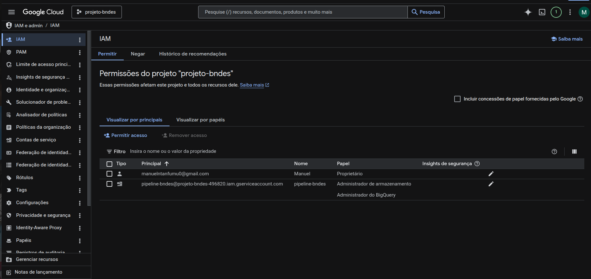
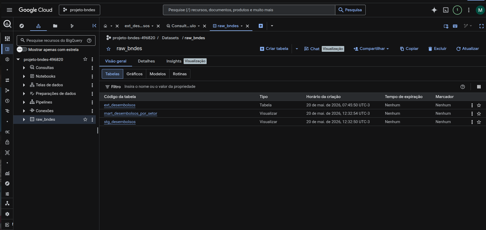
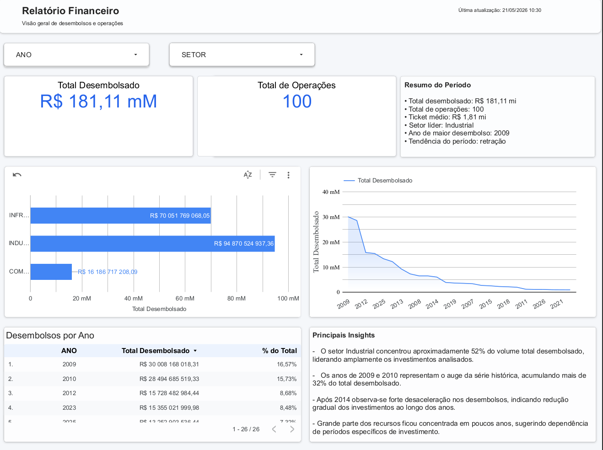

# Analytics Engineering: Pipeline de Desembolsos do BNDES

Este projeto apresenta uma solução completa de engenharia e modelagem de dados utilizando os conceitos da **Modern Data Stack (MDS)**. O objetivo do pipeline é extrair dados brutos de desembolsos através da API pública do BNDES (plataforma CKAN), orquestrar o armazenamento em um Data Lake na nuvem, realizar a carga e transformação dos dados via dbt no BigQuery e disponibilizar os insights estratégicos em um painel executivo interativo.

---

## 🏗️ Arquitetura de Dados

O fluxo foi desenhado seguindo a arquitetura ELT (Extract, Load, Transform) acoplada aos conceitos de organização de medalhão (Bronze/Silver/Gold):

`API BNDES (CKAN)` ➡️ `Python (Docker)` ➡️ `Google Cloud Storage (Bronze)` ➡️ `BigQuery (Silver)` ➡️ `dbt Core (Gold)` ➡️ `Looker Studio`


1. **Ingestão:** Script Python conteinerizado em Docker extrai os dados estruturados da API pública e realiza a paginação e conversão para o formato colunar otimizado **Parquet**.
2. **Data Lake:** Armazenamento resiliente e de baixo custo no **Google Cloud Storage (GCS)**, servindo como nossa Landing Zone / Camada Bronze.
3. **Data Warehouse:** Criação de tabelas externas (**External Tables**) no **BigQuery** mapeando os arquivos do Storage diretamente via SQL, eliminando custos de armazenamento duplicado.
4. **Transformação (dbt):** Modelagem e higienização dos dados dividida entre camadas Staging (Silver) e Marts (Gold) para aplicação das regras de negócio.
5. **Visualização:** Dashboard corporativo desenvolvido no **Looker Studio** para responder perguntas de negócio de tomadores de decisão.

---

## 📸 Evidências do Pipeline em Operação

### 1. Ingestão de Dados e Conteinerização (Docker)
O script Python realiza chamadas eficientes para a API pública do governo. O isolamento do ambiente via contêiner garante portabilidade total da aplicação.


### 2. Armazenamento na Nuvem (Google Cloud Storage)
Os dados persistidos pelo contêiner são organizados de maneira estruturada dentro de buckets na GCP em formato Parquet.



### 3. Integração e Consultas no BigQuery
Criação do Dataset corporativo `raw_bndes` e configuração das External Tables para ler os dados do Storage em tempo real via SQL de alta performance.




### 4. Tomada de Decisão (Dashboard Looker Studio)
Painel interativo final com os KPIs essenciais de liberação de verbas, volumetria por setor econômico e evolução histórica dos desembolsos.



---

## 📖 Dicionário de Dados (Camada Gold/Marts)

A tabela final disponibilizada para consumo de Business Intelligence contém a seguinte estrutura padronizada:

| Nome da Coluna | Tipo de Dado | Descrição | Exemplo |
| :--- | :--- | :--- | :--- |
| `ano` | INTEGER | Ano de competência da liberação da verba | `2024` |
| `mes` | INTEGER | Número do mês da competência da liberação | `8` |
| `setor_bndes` | STRING | Setor macroeconômico de destino do recurso | `Infraestrutura` |
| `subsetor_bndes` | STRING | Segmento específico associado ao setor macro | `Energia elétrica` |
| `desembolsos_reais` | FLOAT | Valor monetário corrigido/líquido liberado (R$) | `12500450.75` |

---

## 🛠️ Boas Práticas e Segurança Aplicadas

* **Isolamento de Credenciais:** Uso estrito de variáveis de ambiente via arquivos `.env` e chaves de contas de serviço salvas localmente, mas explicitamente ignoradas via `.gitignore` para prevenir vazamentos acidentais de segurança no GitHub.
* **Infraestrutura Imutável:** Uso de arquivos `Dockerfile` e `docker-compose.yml` garantindo que qualquer desenvolvedor consiga rodar a esteira com os mesmos comandos de forma reprodutível.
* **Documentação Viva:** Criação do arquivo de exemplo `credenciais-gcp.example.json` para facilitar o onboarding de novos engenheiros na estrutura do projeto.

---

## 🚀 Como Executar o Projeto

### Pré-requisitos
* Git instalado
* Docker e Docker Compose instalados
* Uma conta ativa na Google Cloud Platform (GCP) com uma Service Account gerada (formato JSON).

### Passo a Passo

1. **Clonar o Repositório:**
   ```bash
git clone [https://github.com/seu-usuario/projeto_bndes.git](https://github.com/seu-usuario/projeto_bndes.git)
   cd projeto_bndes

   2. **Configurar Credenciais**:
   Insira o arquivo JSON da sua chave GCP na raiz do projeto e mude o nome dele para credentials.json (ou o nome definido no seu arquivo .env).

Crie um arquivo .env baseado nas configurações do seu ambiente de nuvem.

Construir e Rodar o Container de Ingestão:
   git clone [https://github.com/seu-usuario/projeto_bndes.git](https://github.com/seu-usuario/projeto_bndes.git)
   cd projeto_bndes

  3. **Construir e Rodar o Container de Ingestão**:
     docker-compose up --build

  4. **Executar as Transformações dbt**:
(Garantir o profiles.yml configurado apontando para o seu BigQuery)
dbt run
dbt test
